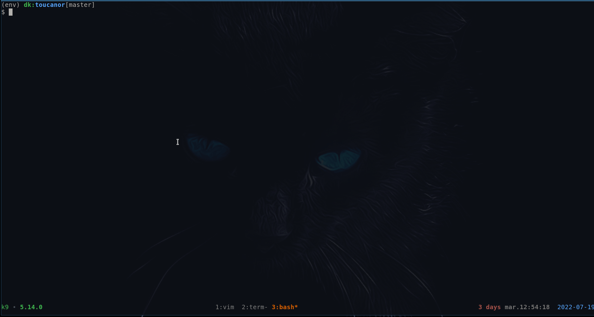

## TOUCANOR GAME

How to make a simple grid-game on the terminal !

## HOW TO INSTALL

```
make install

# optional
# For the code formating
make format
# For the linter
make lint
```

## HOW TO LAUNCH

```
make run
# it will request to run on sudo,
# yes, the sudo because the keyboard lib can not be use undo normal user,
```

Use you arrow keys to get eggs accross the environment.

## DEMO


